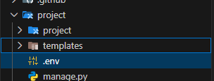

# Paquetes que te recomiendo cuando trabajes con Django

## 1. Bootstrap

Ideal para cuando el frontend debe salir rapido, [Documentacion oficial](https://pypi.org/project/django-bootstrap5/).

Comando de instalacion:

```bash
pip install django-bootstrap5
```

Configuracion en el settings.py:

```python
INSTALLED_APPS = [
    ...
    # terceros
    "django_bootstrap5", # agregar esta linea
]
```

Preparar la carpeta de templates para que funcione tambien fuera de las apps que hagas en django:

```python
TEMPLATES = [
    {
        "BACKEND": "django.template.backends.django.DjangoTemplates",
        "DIRS": [
            BASE_DIR / "templates", # agregar esta linea
        ],
        "APP_DIRS": True,
        "OPTIONS": {
            "context_processors": [
                "django.template.context_processors.request",
                "django.contrib.auth.context_processors.auth",
                "django.contrib.messages.context_processors.messages",
            ],
        },
    },
]
```

Crear la plantilla base:

```html
<!DOCTYPE html>
<html lang="en">
  <head>
     <!-- Agregar estas lineas al template de base para tener estilos y funcionalidad de js -->
    
    
    <meta charset="UTF-8" />
    <meta name="viewport" content="width=device-width, initial-scale=1.0" />
    <title>
      
        Django Project
      
    </title>
  </head>
  <body>
    <div class="container-fluid">
       <!-- Esto se integra genial con la API de mensajes de django -->
        
            <!-- row - col - card -->
        
    </div>
  </body>
</html>
```

## 2. Python Dot Env

Este paquete es muy importate para usar archivos .env y no exponer credenciales importantes, [Pagina de pypi](https://pypi.org/project/python-dotenv/).

Comando de instalacion:

```bash
pip install python-dotenv
```

Ahora creamos nuestro archivo **.env** a nivel del proyecto



Ahora agreamos el siguiente codigo en el **settings.py** casi al inicio del archivo

```python
from pathlib import Path
import os # agregamos esta linea
from dotenv import load_dotenv # este el paquete que acabamos de instalar

load_dotenv()  # Cargar variables de entorno desde un archivo .env si existe

...

DEBUG = os.getenv("DJANGO_DEBUG") # accedemos a la variable de entorno definida en .env
```

## 3. Django HTMX

HTMX es una libreria que permite hacer aplicaciones web mas dinamicas sin necesidad de usar tanto javascript, [Documentacion oficial](https://django-htmx.readthedocs.io/en/latest/installation.html).

Comando de instalacion:

```bash
pip install django-htmx
```

Ahora tenemos que poner esta app en las apps instaladas de django:

```python
INSTALLED_APPS = [
  #...
  "django_htmx",
]
```

y finalmente agregamos el middleware:

```python

MIDDLEWARE = [
    #...
    "django_htmx.middleware.HtmxMiddleware",
]
```
