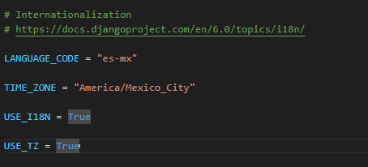
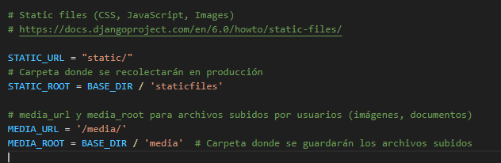

# Primeros pasos por el settings.py

## Cambiar la internacionalizacion por la necesaria en el proyecto

```python
LANGUAGE_CODE = "es-mx"

TIME_ZONE = "America/Mexico_City"

USE_I18N = True

USE_TZ = True
```



## Configurar los archivos estaticos y media

```python
# Static files (CSS, JavaScript, Images)
# https://docs.djangoproject.com/en/6.0/howto/static-files/

STATIC_URL = "static/"
# Carpeta donde se recolectarán en producción
STATIC_ROOT = BASE_DIR / 'staticfiles'

# media_url y media_root para archivos subidos por usuarios (imágenes, documentos)
MEDIA_URL = '/media/'
MEDIA_ROOT = BASE_DIR / 'media'  # Carpeta donde se guardarán los archivos subidos
```



seguido a ese, se deben configurar las URL para poder servir los archivos en moodo desarrollo

```python
from django.contrib import admin
from django.urls import path
from django.conf import settings  # importar settings
from django.conf.urls.static import static  # importar static

urlpatterns = [
    path("admin/", admin.site.urls),
]

if settings.DEBUG:
    urlpatterns += static(settings.MEDIA_URL,
                          document_root=settings.MEDIA_ROOT)
    urlpatterns += static(settings.STATIC_URL,
                          document_root=settings.STATIC_ROOT)
```
